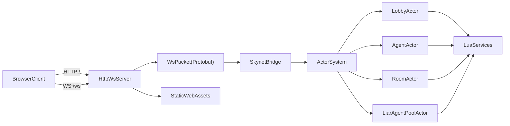
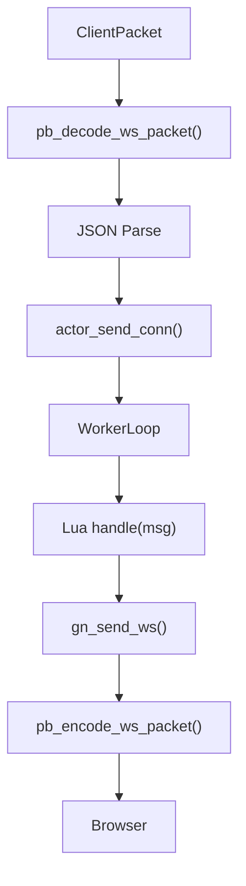
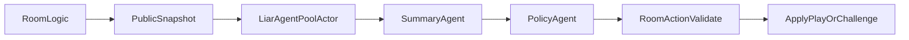

# Groundnet

Groundnet 是一个参考 Skynet 思想实现的轻量级游戏服务器框架，核心技术栈为 `C++17 + Lua 5.4 + WebSocket + Protobuf`。  
仓库当前包含两个可运行 Demo：

- 骗子酒馆（Liar's Poker）
- 成语接龙（支持可选大模型机器人）

这套工程的目标不是做一个通用 Web 后端，而是验证一种偏游戏服风格的架构：**网络层负责连接和转发，Actor 运行时负责调度，Lua 服务脚本负责业务状态机**。

## 核心特性

- 多 Actor 运行时，每个服务 Actor 拥有独立 `lua_State`
- 消息驱动调度，避免同一服务内并发踩状态
- HTTP 和 WebSocket 同端口运行
- WebSocket 二进制帧 + Protobuf 包封装
- 业务消息目前仍使用 JSON，便于快速迭代
- 骗子酒馆已支持双阶段 Agent 机器人
- Linux 下已支持通过 ARK `responses` 接口调用豆包模型

## 整体架构



## 运行时消息流



## 骗子酒馆 Agent 架构

骗子酒馆机器人已经不是简单随机出牌，而是拆成了**公开信息摘要**和**座位私有决策**两段：



### 信息隔离规则

- 摘要 Agent 只能看到公开信息：
  - 已出牌事件
  - 已开牌 reveal
  - 各座位剩余张数
  - 当前回合 / 阶段
- 决策 Agent 才能看到：
  - 公开摘要
  - 当前座位自己的手牌

这保证了“每个 Agent 只知道自己应该知道的信息”。

## 关键模块

### C++ 侧

- `src/main.cpp`
  - 程序入口
  - 自动解析 `lua/`、`web/` 目录
  - 启动 HTTP/WS 服务和周期 `tick`

- `src/core/actor_system.cpp`
  - Actor 注册、邮箱队列、worker 调度
  - Lua API 桥接：
    - `gn_send`
    - `gn_spawn`
    - `gn_send_ws`
    - `gn_bind_conn`
    - `gn_unbind_conn`
    - `gn_llm_chat`
  - Linux 下 `gn_llm_chat` 会调用 `lua/ark_chat.py`

- `src/core/skynet.cpp`
  - 网络层和 Actor 系统之间的桥接
  - 负责把客户端包投递到对应 Actor

- `src/net/http_ws_server.cpp`
  - HTTP 静态资源服务
  - WebSocket 连接管理
  - 收发包路由

### Lua 侧

- `lua/service/lobby.lua`
  - 登录鉴权
  - 房间创建 / 加入 / 匹配

- `lua/service/agent.lua`
  - 每连接一个 Agent Actor
  - 负责 token 校验、房间转发、大厅状态查询

- `lua/service/room_logic.lua`
  - 骗子酒馆房间状态机
  - 玩家出牌、质疑、左轮结算
  - 机器人决策调度与回退逻辑

- `lua/service/liar_agent_runtime.lua`
  - 公共战局摘要 prompt
  - 决策 prompt
  - 输出解析和重试

- `lua/service/liar_agent_pool.lua`
  - 全局 Agent 执行器
  - 负责异步处理摘要与决策任务

- `lua/service/idiom_room_logic.lua`
  - 成语接龙规则
  - LLM 连通性检查

## 目录结构

```text
include/              公共头文件
src/core/             Actor 运行时、协议桥接
src/net/              HTTP / WebSocket 实现
lua/bootstrap.lua     Lua 启动入口
lua/service/          Lobby / Agent / Room 服务
lua/ark_chat.py       Linux 下 ARK responses 接口调用 helper
web/                  前端静态页面与交互逻辑
third_party/          本地依赖（默认不提交）
```

## 构建前准备

当前 `CMakeLists.txt` 默认依赖本地目录 `third_party/lua-5.4.6`。  
如果你是第一次在新机器上构建，而这个目录不存在，需要先准备 Lua 5.4.6 源码：

```bash
mkdir -p third_party
curl -L "https://www.lua.org/ftp/lua-5.4.6.tar.gz" -o "third_party/lua-5.4.6.tar.gz"
tar -xzf "third_party/lua-5.4.6.tar.gz" -C third_party
rm "third_party/lua-5.4.6.tar.gz"
```

## 构建

### 方案 A：在项目根目录执行

```bash
cd ~/MyGame/MyGame-main
cmake -S . -B build
cmake --build build -j2
```

### 方案 B：已经进入 `build/` 目录

```bash
cd ~/MyGame/MyGame-main/build
cmake ..
cmake --build . -j2
```

生成文件：

- Linux / macOS
  - `build/groundnet`
  - `build/groundnet_roomd`
- Windows
  - `build/Debug/groundnet.exe` 或 `build/Release/groundnet.exe`
  - `build/Debug/groundnet_roomd.exe` 或 `build/Release/groundnet_roomd.exe`

## 运行

### Linux / macOS

```bash
cd ~/MyGame/MyGame-main
./build/groundnet
```

### Windows

```powershell
.\build\Release\groundnet.exe
```

默认访问地址：

- HTTP: <http://127.0.0.1:8765/>
- WebSocket: `ws://127.0.0.1:8765/ws`

### 指定资源目录

```bash
./build/groundnet <lua目录> <web目录>
```

## 大模型配置

### 推荐做法：本地环境文件

可以在项目根目录创建 `.env.local`：

```bash
ARK_API_KEY=你的Key
ARK_MODEL_ID=doubao-seed-2-0-pro-260215
ARK_DEFAULT_MODEL=doubao-seed-2-0-pro-260215
LIAR_SUMMARY_MODEL=doubao-seed-2-0-pro-260215
LIAR_BOT_LLM=1
```

启动前加载：

```bash
set -a
source .env.local
set +a
./build/groundnet
```

### Linux 下的调用方式

Linux 现在不是直接在 C++ 里手写 HTTP，而是通过：

- `src/core/actor_system.cpp`
- `lua/ark_chat.py`

使用 ARK 官方 `responses` 风格请求来完成模型调用。

### 当前已支持的环境变量

- `ARK_API_KEY`
- `VOLCENGINE_API_KEY`
- `ARK_MODEL_ID`
- `ARK_DEFAULT_MODEL`
- `LIAR_BOT_LLM=1`
- `LIAR_SUMMARY_MODEL`
- `LIAR_SUMMARY_WINDOW`
- `LIAR_POLICY_RETRY_LIMIT`
- `LIAR_AGENT_TIMEOUT_SEC`
- `LIAR_RANDOM_FALLBACK_COOLDOWN_SEC`

## 成语接龙机器人

成语接龙会在开局前检查 LLM 是否可用。  
如果接口不可用，会向前端返回 `llm_unavailable`。

## 骗子酒馆机器人

骗子酒馆有两条策略路径：

1. **Agent 模式**
   - 前提：`LIAR_BOT_LLM=1`
   - 前提：ARK 接口可用
2. **随机回退模式**
   - 未启用大模型
   - 或接口不可用
   - 或模型输出非法

大厅会显示当前大模型状态：

- `Agent 已在线`
- `Agent 回退随机`
- `未启用大模型`

房间中机器人座位也会显示当前状态，例如：

- `Agent待命`
- `Agent思考中`
- `回退随机：...`

## 前端说明

当前前端是原生静态页面：

- `web/index.html`
- `web/styles.css`
- `web/app.js`
- `web/characters.js`

UI 已做过一轮强化，包括：

- 六边形未来战术桌
- 3D 风格角色展示
- 翻牌动画
- 质疑目标提示
- 枪击弹道 / 枪口闪光 / 桌面震动
- 大厅大模型状态卡片

## 稳定性说明

- 同一 Actor 串行执行，避免同一 `lua_State` 并发访问
- `spawn/init` 有异常保护
- WebSocket 发送路径做了每连接互斥保护
- 房间内机器人调用从主状态机中拆成异步 Actor 流程
- 非法模型输出会回退到随机策略，避免整局卡死

## 当前限制

- 网络事件层仍是 `WSAPoll`（Windows）/`select`（POSIX），未切到 `epoll` / `IOCP`
- 业务消息体仍主要是 JSON，尚未全量迁移到 Protobuf Schema
- 当前仓库目录不是 Git 仓库时，无法直接执行 `git push` 或 `gh` 发布
- `third_party/` 默认在 `.gitignore` 中，需要每台机器自行准备 Lua 源码依赖

## 适合继续扩展的方向

- 拆分房间进程 / IPC / 分布式房间
- 把业务消息逐步迁移成完整 Protobuf
- 给 Agent 增加长期记忆、工具调用和跨局统计
- 增加更完整的浏览器自动化测试和回放系统
